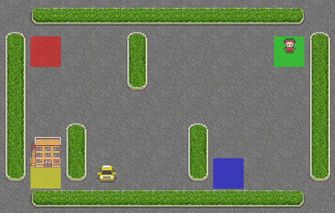
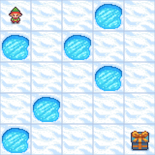

| **Algorithm** | **Type** | **Environment** | **Environment GIF** |
| ------------- |--------- | --------------- | ------------------- |
| [Policy Iteration](notebooks/dynamic_programming/policy_iteration.ipynb) | Value Based | **Taxi-v3**: Pick up and drop off passengers at the right location in a 5×5 grid world. |  |
| [On-Policy First-Visit MC Control](notebooks/monte_carlo/on_policy_first_visit_mc_control.ipynb) | Monte Carlo | **FrozenLake-v1**: A grid-based environment where an elf must reach the present without falling into holes. |  |