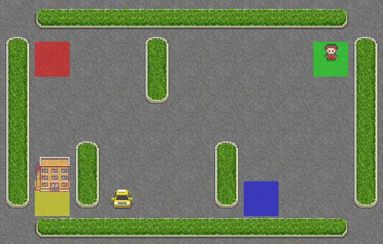

| **Algorithm** | **Type** | **Environment** | **Environment GIF** |
| ------------- |--------- | --------------- | ------------------- |
| [Policy Iteration](notebooks/dynamic_programming/policy_iteration.ipynb) | Value-Based | **Taxi-v3**: Pick up and drop off passengers at the right location in a 5×5 grid world. |  |